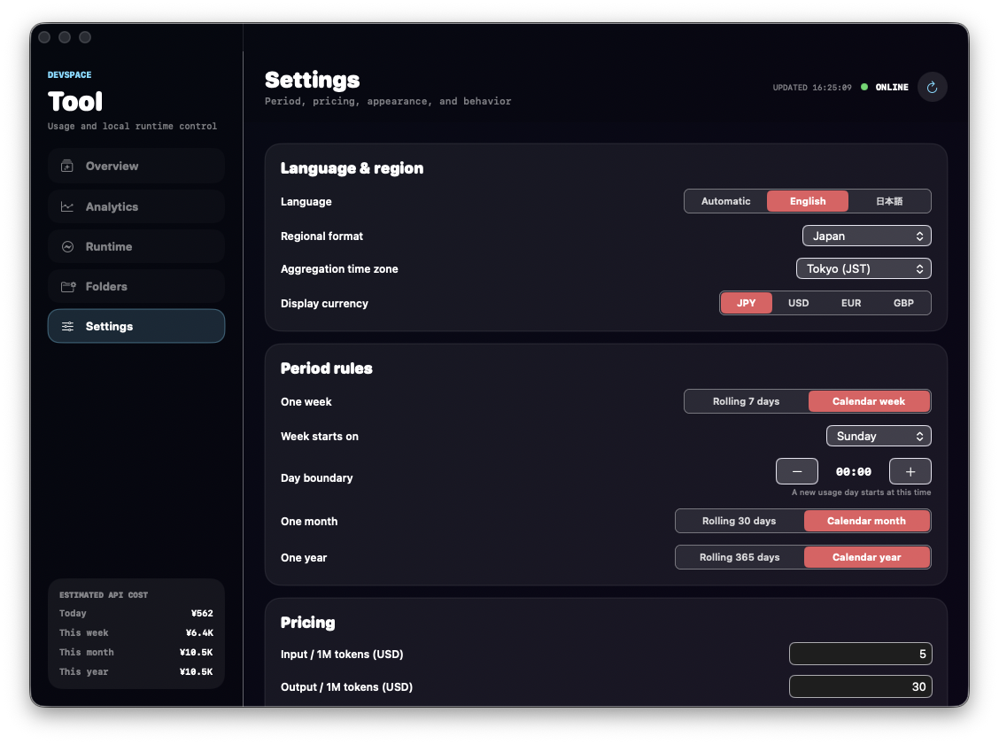

<p align="center">
  <picture>
    
  </picture>
</p>

<h1 align="center">DevSpace</h1>

<p align="center"><strong>Turn ChatGPT from an adviser into an operator that can work in your real development environment.</strong></p>
<p align="center">A self-hosted MCP server for reading local code, making scoped edits, running Terminal checks, and inspecting Git changes.</p>

<p align="center">
  <a href="README.md">日本語</a> ｜ <strong>English</strong>
</p>

> [!IMPORTANT]
> DevSpace can read, edit, search, and run Terminal commands inside approved local folders. Start with one specific project folder. Do not allow your entire home directory or folders containing credentials.

## What changes after installing DevSpace

Without DevSpace, you copy code into ChatGPT, paste suggested commands into a Terminal, and return the output to the chat. DevSpace removes much of that handoff by letting ChatGPT inspect and operate on an approved real project directly.

| Before | With DevSpace |
|---|---|
| Paste snippets and ask ChatGPT to guess the context | ChatGPT inspects the actual files, dependencies, and Git state |
| Apply suggested code manually | ChatGPT makes scoped edits to the relevant files |
| Paste test and build output back into the chat | ChatGPT runs the command and reads the result |
| Risk branch conflicts across parallel tasks | Use isolated Git worktrees for separate sessions |
| Repeat project rules in every conversation | Load `AGENTS.md` / `CLAUDE.md` automatically |

A typical request can be as direct as:

```text
Inspect this repository and identify the cause of the layout regression.
Make the smallest change limited to the related files, run one build,
and report the diff and remaining risks. Do not commit, push, or deploy.
```

DevSpace is not an opaque autonomous agent that runs without visibility. File operations and shell commands are exposed as tool calls, making the scope and result of the work easier to inspect.

## Enhancements in this fork

This repository builds on [Waishnav/devspace](https://github.com/Waishnav/devspace) and adds changes developed from day-to-day production use.

- **Japanese-first onboarding** with a macOS Tailscale Funnel quickstart and bilingual recovery guidance
- **Compatibility fixes for recent ChatGPT model updates** to reduce tool-call latency and failures
- **DevSpace Tool for macOS** for runtime status, approved folders, usage analytics, and cost estimates
- **Safer local operation** through approved roots, Owner Password approval, and PID-validated control scripts
- **Production-oriented workflows** including Git worktrees, project instructions, skills, subagents, and job/browser/computer-use foundations
- **Usage visibility** for tokens, calls, estimated API cost, time periods, and workspace-level analysis

## Core capabilities

After connecting DevSpace, ChatGPT can:

- read, create, and edit files
- search source code and inspect directories
- run tests, builds, Git inspection, and package scripts
- create isolated Git worktrees for parallel tasks
- follow project rules in `AGENTS.md` and `CLAUDE.md`
- discover local skills and optional subagents
- show token usage, estimated API cost, and workspace analytics

The optional macOS **DevSpace Tool** provides:

- Automatic / English / Japanese UI switching
- Overview, Analytics, Runtime, Folders, and Settings screens
- runtime status plus optional start/stop controls
- approved-root visibility
- token, call, and estimated API-cost analytics
- Aurora, Monochrome, and Minimal themes
- safe copy actions for the MCP URL, diagnostics command, and Owner Password retrieval command

<p align="center">
  
</p>
<p align="center"><sub>Configure language, aggregation periods, pricing conversion, appearance, and runtime behavior from the macOS UI.</sub></p>

## Fastest setup: macOS + Tailscale Funnel

DevSpace listens only on `127.0.0.1:7676`. Tailscale Funnel publishes that local endpoint through HTTPS.

ChatGPT Web must reach the MCP server from the internet. Use **Tailscale Funnel**, not tailnet-only Tailscale Serve. The Funnel URL is public, but DevSpace still requires Owner Password approval before access is granted.

### Requirements

- macOS 14+ or Linux
- Git
- Node.js `>=22.19 <27`
- npm
- a Tailscale account
- a ChatGPT environment that supports Developer mode and custom Apps

Check your tools:

```bash
node -v && npm -v && git --version
```

macOS Node.js example:

```bash
brew install node@22 && brew link --overwrite --force node@22
```

### 1. Install and sign in to Tailscale

On macOS, use a Tailscale build that provides CLI access and supports Funnel.

Homebrew example:

```bash
brew install --cask tailscale-app && open -a Tailscale
```

After signing in:

```bash
tailscale status
```

### 2. Clone and run the guided setup

Replace `~/Projects` with the folder ChatGPT is allowed to access.

```bash
git clone https://github.com/uniplanck/devspace.git ~/devspace && cd ~/devspace && bash ./scripts/quickstart-tailscale.sh ~/Projects
```

The script:

1. validates Node.js, Git, npm, and Tailscale
2. runs `npm ci`, typecheck, tests, and build
3. registers the `devspace` command with `npm link`
4. maps Tailscale Funnel to port `7676`
5. creates `~/.devspace/config.json`, `auth.json`, and `tool.json` with mode `600`
6. starts DevSpace in Full tool mode in the background
7. prints the public `https://<device>.<tailnet>.ts.net/mcp` URL
8. copies the MCP URL on macOS

The first Funnel command may open a browser approval page.

### 3. Verify the runtime

```bash
cd ~/devspace && bash ./scripts/devspace-control.sh status
```

Expected state:

- DevSpace runtime: `ONLINE`
- Local MCP: `http://127.0.0.1:7676/mcp`
- Public MCP: `https://xxxx.ts.net/mcp`
- no critical failure from `devspace doctor`

### 4. Connect ChatGPT

Current OpenAI setup flow follows the steps below. Labels can change slightly as ChatGPT is updated.

1. Open **Settings → Security and login**.
2. Enable **Developer mode**.
3. Open **Settings → Plugins**, Apps, or Connectors.
4. Select `+` and create a developer-mode App.
5. Enter the MCP server URL printed by the script:

```text
https://<device>.<tailnet>.ts.net/mcp
```

6. Complete the DevSpace approval page using the Owner Password.

Do not paste the Owner Password into a README, issue, or chat. On macOS, copy it directly from the local auth file:

```bash
python3 -c 'import json,pathlib; print(json.loads((pathlib.Path.home()/".devspace/auth.json").read_text())["ownerToken"], end="")' | pbcopy
```

Linux display command:

```bash
python3 -c 'import json,pathlib; print(json.loads((pathlib.Path.home()/".devspace/auth.json").read_text())["ownerToken"])'
```

### 5. Test the connection safely

Ask ChatGPT:

```text
Use DevSpace to list only the approved workspace candidates. Do not modify files or run Terminal commands.
```

Then test a repository in read-only mode:

```text
Open <absolute-project-path> as a workspace and report git branch, git status --short, and the latest commit. Do not modify, commit, push, or deploy anything.
```

## Daily commands

Start:

```bash
cd ~/devspace && bash ./scripts/devspace-control.sh start
```

Stop DevSpace:

```bash
cd ~/devspace && bash ./scripts/devspace-control.sh stop
```

Stop DevSpace and reset Funnel:

```bash
cd ~/devspace && bash ./scripts/devspace-control.sh stop --with-funnel
```

Restart:

```bash
cd ~/devspace && bash ./scripts/devspace-control.sh restart
```

Status:

```bash
cd ~/devspace && bash ./scripts/devspace-control.sh status
```

Logs:

```bash
cd ~/devspace && bash ./scripts/devspace-control.sh logs
```

Copy the MCP URL:

```bash
cd ~/devspace && bash ./scripts/devspace-control.sh url
```

Copy the safe Owner Password retrieval command:

```bash
cd ~/devspace && bash ./scripts/devspace-control.sh owner-cmd
```

## DevSpace Tool for macOS

```bash
cd ~/devspace/extensions/devspace-tool && zsh ./build-macos.sh && open ".build/DevSpace Tool.app"
```

Use **Settings → Language** to switch between `Automatic / English / 日本語` immediately.

The **DevSpace** menu provides:

- Copy MCP URL
- Copy diagnostics command
- Copy the local Owner Password retrieval command, not the password itself
- Open configuration folder
- Open the Japanese or English setup guide

Optional runtime configuration in `~/.devspace/tool.json` is created by the guided setup:

```json
{
  "host": "127.0.0.1",
  "port": 7676,
  "runtimeCommand": "DEVSPACE_TOOL_MODE=full devspace serve",
  "runtimeProcessMatch": "devspace.*serve",
  "usdJpyRate": 160
}
```

## Manual setup

```bash
git clone https://github.com/uniplanck/devspace.git ~/devspace
cd ~/devspace
npm ci
npm run typecheck
npm test
npm run build
npm link
devspace init
tailscale funnel --bg 7676
DEVSPACE_TOOL_MODE=full devspace serve
```

During `devspace init`, enter:

- the project folder(s) ChatGPT may access
- port `7676`
- the public origin `https://xxxx.ts.net` without `/mcp`

Register the same URL with `/mcp` appended in ChatGPT.

## Update

```bash
cd ~/devspace && git pull --ff-only && npm ci && npm run typecheck && npm test && npm run build && npm link
bash ./scripts/devspace-control.sh stop && bash ./scripts/devspace-control.sh start
```

## Security rules

- keep `allowedRoots` narrow
- never commit `~/.devspace/auth.json`
- never paste Owner Passwords, tokens, cookies, or private keys into chat
- begin with read-only connection tests
- use `AGENTS.md` to require approval for main pushes, production deploys, billing actions, destructive database operations, and external messages
- stop DevSpace and Funnel when they are not needed
- connect only to MCP servers you have reviewed and trust
- the stop script verifies that a recorded PID belongs to a DevSpace serve process and refuses to kill unknown processes

## Troubleshooting

Connection failure:

```bash
cd ~/devspace
bash ./scripts/devspace-control.sh status
tailscale funnel status
devspace doctor
```

Check that:

- DevSpace is listening on `127.0.0.1:7676`
- the public URL uses HTTPS
- the ChatGPT URL ends with `/mcp`
- Tailscale Funnel is active
- MagicDNS, HTTPS, and Funnel permissions are enabled
- initial public DNS propagation has completed

A `401` before Owner Password approval is expected.

Native dependency error:

```bash
cd ~/devspace && npm rebuild better-sqlite3 && npm run build && devspace doctor
```

Reconfigure:

```bash
devspace init --force
```

## Main CLI commands

```text
devspace serve
devspace init
devspace init --force
devspace doctor
devspace config get
devspace config set publicBaseUrl <url|null>
devspace agents ls
devspace jobs ls
devspace computer doctor
```

## Development

```bash
npm ci
npm run typecheck
npm test
npm run build
npm run start
```

## Credits

This repository is a fork of [Waishnav/devspace](https://github.com/Waishnav/devspace). Thanks to the original author and contributors.

License: MIT
