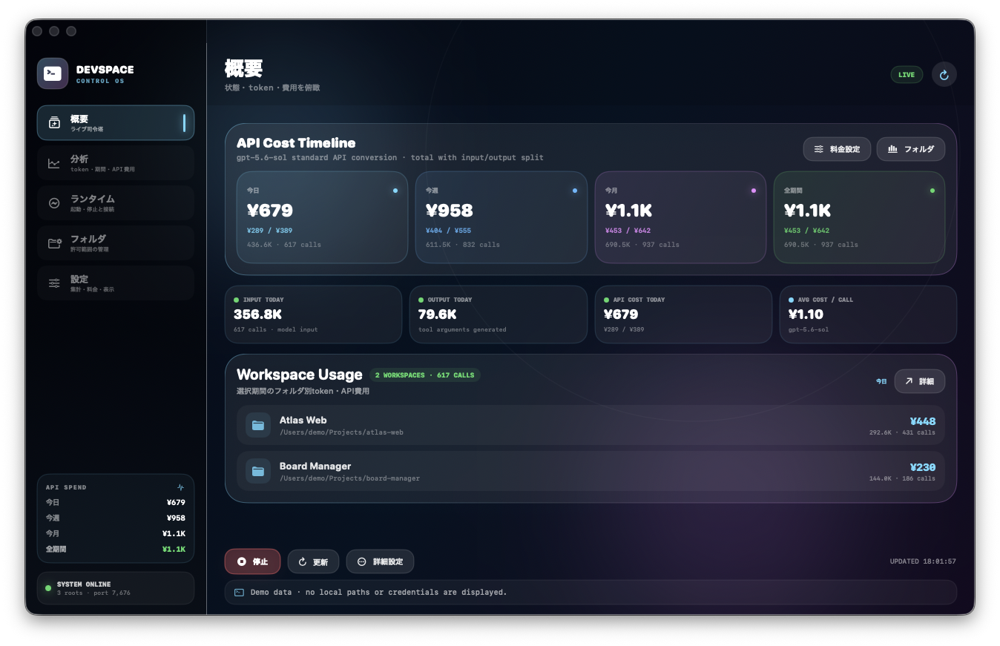
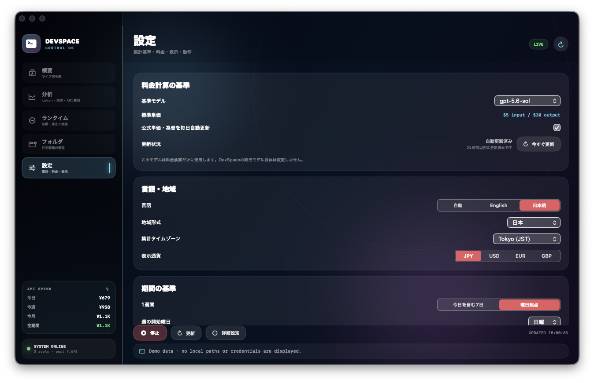

# DevSpace Tool

**日本語** ｜ [English](#english)

DevSpaceの利用状況とローカルランタイムを確認する、macOS向けのバイリンガル補助アプリです。

<p align="center">
  
</p>
<p align="center"><sub>GPT-Agent Toolと共通のControl OS UI、モデル別API料金、token、ランタイム、許可フォルダを一画面で確認。</sub></p>

<p align="center">
  
</p>

## 主な機能

- `Automatic / English / 日本語` の即時切替
- Overview / Analytics / Runtime / Folders / Settings
- DevSpaceのONLINE/OFFLINE、Host、Port確認
- 設定済みの場合のみランタイム起動・停止
- GPT-Agent Toolと同系統のControl OS UI、API Cost Timeline、tokenサマリー
- 今日・週・月・年・任意期間のtoken、呼出回数、概算API費用
- フォルダ別利用状況
- 料金計算の基準モデルを選択（実行モデル自体は変更しない）
- OpenAI公式料金表からGPT-5系モデルと単価を自動取得し、将来モデルも一覧へ追加
- ECB為替からUSD/JPY・USD/EUR・USD/GBPを24時間ごとに自動更新
- 利用履歴にモデルIDが含まれる場合は、そのイベントの実モデル単価を優先
- 許可フォルダのFinder追加・パス追加・削除
- `config.json`の自動バックアップ、親子フォルダ重複整理、稼働中の自動再起動
- Aurora / Monochrome / Minimalテーマ
- GPT-Agent Toolと同じ右揃え設定レイアウトとガラス調ダッシュボード
- DevSpaceロゴから生成するmacOSアプリアイコン
- DevSpaceメニューから以下を安全に実行
  - MCP URLをコピー
  - 診断コマンドをコピー
  - Owner Passwordそのものではなく、ローカル取得コマンドをコピー
  - `~/.devspace` をFinderで開く
  - 日本語 / Englishセットアップガイドを開く

## 必要環境

- macOS 14以降
- Swift 5.9以降
- ローカルに設定済みのDevSpace

## Build・起動

```bash
cd extensions/devspace-tool
zsh ./build-macos.sh
open ".build/DevSpace Tool.app"
```

アプリは `.build/DevSpace Tool.app` に生成され、DevSpaceロゴ由来のアプリアイコンとローカルのad-hoc署名が付きます。

README掲載用スクリーンショットの撮影条件は [`docs/assets/devspace-tool/README.md`](../../docs/assets/devspace-tool/README.md) にまとめています。

## 言語切替

アプリ内の **Settings → Language** から選択します。

- `Automatic`: macOSの現在言語に追従
- `English`: 英語で固定
- `日本語`: 日本語で固定

設定はmacOSのAppStorageへ保存され、再起動後も維持されます。

## 設定

DevSpace Toolは次を読み取ります。

- `~/.devspace/config.json`
- `~/.local/share/devspace/usage-history.jsonl`
- `~/.devspace/tool.json`

`~/.devspace/tool.json` の例：

```json
{
  "host": "127.0.0.1",
  "port": 7676,
  "runtimeCommand": "DEVSPACE_TOOL_MODE=full devspace serve",
  "runtimeProcessMatch": "devspace.*serve",
  "usdJpyRate": 160
}
```

`runtimeCommand` と `runtimeProcessMatch` が明示設定されるまで、起動・停止操作は実行されません。

> [!IMPORTANT]
> 料金表示はDevSpaceが記録したtoken量を、選択した基準モデルまたは履歴に記録された実モデルの単価で換算した概算です。基準モデルの変更はDevSpaceの実行モデルを変更しません。ChatGPTのサブスクリプション料金やプロバイダーの実請求額ではありません。

---

<a id="english"></a>

## English

DevSpace Tool is a bilingual macOS companion application for DevSpace.

<p align="center">
  
</p>

### Features

- Automatic / English / Japanese language switching
- Overview, Analytics, Runtime, Folders, and Settings
- local runtime status and optional start/stop controls
- add approved folders from Finder or a path, and remove them with confirmation
- automatic config backups, parent/child root compaction, and runtime restart after changes
- the same Control OS dashboard language as GPT-Agent Tool, including an API Cost Timeline and token summary
- token, call, and estimated API-cost analytics by period and folder
- selectable pricing-reference model without changing the runtime model
- automatic discovery of GPT-5 family models and standard rates from the official OpenAI pricing page
- daily ECB-based USD/JPY, USD/EUR, and USD/GBP updates
- per-event model pricing when the usage-history record includes a model ID
- Aurora, Monochrome, and Minimal themes
- the same right-aligned settings layout and glass dashboard used by the current GPT-Agent Tool
- a native macOS app icon generated from the DevSpace logo
- a DevSpace command menu for copying the MCP URL, diagnostics command, and safe Owner Password retrieval command
- shortcuts to the configuration folder and setup guide

### Requirements

- macOS 14 or later
- Swift 5.9 or later
- a configured local DevSpace installation

### Build

```bash
cd extensions/devspace-tool
zsh ./build-macos.sh
open ".build/DevSpace Tool.app"
```

The app is written to `.build/DevSpace Tool.app`, includes a DevSpace app icon, and receives an ad-hoc local signature.

Screenshot requirements are documented in [`docs/assets/devspace-tool/README.md`](../../docs/assets/devspace-tool/README.md).

Runtime start/stop remains disabled until `runtimeCommand` and `runtimeProcessMatch` are explicitly configured in `~/.devspace/tool.json`.

Cost values are estimates based on recorded tokens and either the selected pricing-reference model or an event-level model ID when available. Choosing a pricing model does not change the model used by DevSpace. These values are not ChatGPT subscription billing or provider invoices.
